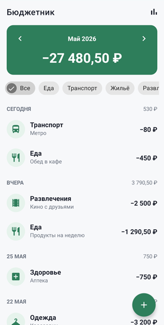
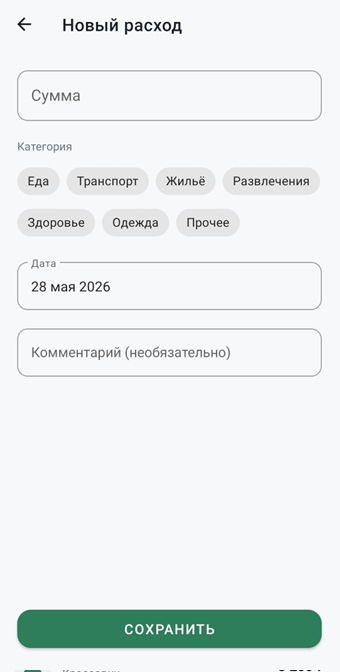
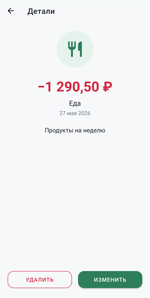
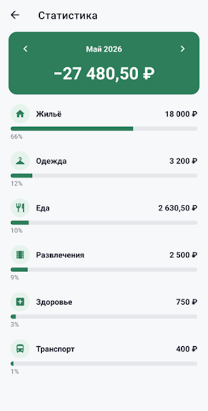
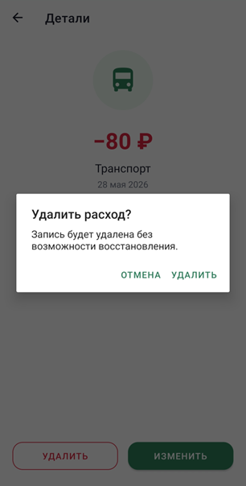
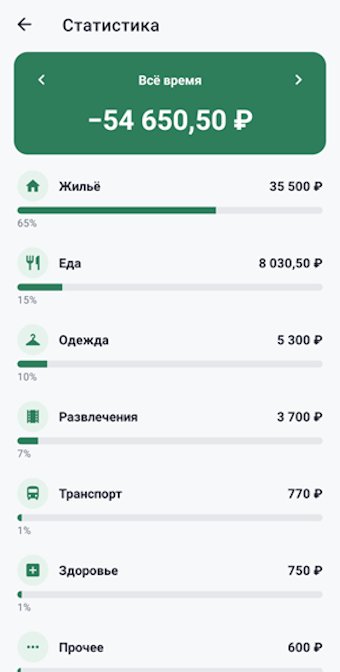

# Бюджетник

Android-приложение для учёта личных расходов. Учебный проект.

## Что умеет

- Добавлять, редактировать и удалять расходы (сумма, категория, дата, комментарий)
- Хранить данные в SQLite — записи не теряются после перезапуска
- Группировать список по датам
- Считать сумму за выбранный месяц, листать месяцы стрелками
- Фильтровать по категориям
- Показывать статистику по категориям в процентах

## Экраны

- `MainActivity` — список расходов
- `AddEditExpenseActivity` — добавление / редактирование
- `ExpenseDetailsActivity` — детали записи
- `StatisticsActivity` — статистика по категориям

## Стек

- Java 11
- Android SDK 24–36 (минимум Android 7.0)
- AndroidX, Material Components, RecyclerView
- SQLite

## База данных

Таблица `expenses`: `id`, `amount`, `category`, `date` (YYYY-MM-DD), `description`.

## Запуск

1. Открыть проект в Android Studio.
2. Дождаться Gradle Sync.
3. Run.

Или из консоли:

```
gradlew assembleDebug
```

APK будет в `app/build/outputs/apk/debug/`.

## Скриншоты

| | |
|---|---|
|  |  |
| Рисунок 1 — Главный экран со списком расходов | Рисунок 2 — Экран добавления нового расхода |
|  |  |
| Рисунок 3 — Экран подробной информации о расходе | Рисунок 4 — Экран статистики с процентным распределением по категориям |
|  |  |
| Рисунок 5 — Диалог подтверждения удаления записи | Рисунок 6 — Экран статистики в режиме отображения общей суммы за весь период |
